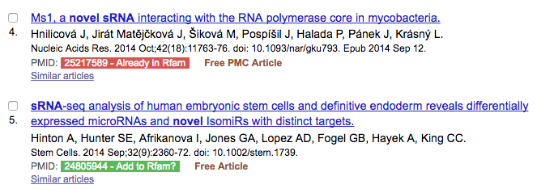

# Rfam Pubmed ID Highlighter

*Google Chrome extension for identifying new literature for the [Rfam database](http://rfam.xfam.org) based on [Pubmed](http://www.ncbi.nlm.nih.gov/pubmed/) search results.*

## Usage

For example, this [Pubmed search](http://www.ncbi.nlm.nih.gov/pubmed/?term=novel%5Btitle%5D%20srna%5Btitle%5D&cmd=DetailsSearch) for papers about novel sRNAs shows which papers have already been processed and which ones might represent new Rfam families.

## Installation

1. Clone or download the repository
2. In Google Chrome open Tools -> Extensions
3. Check the "Developer Mode" option (if not already)
4. Select "Load unpacked extension"
5. Navigate to the recently cloned folder and click Select
